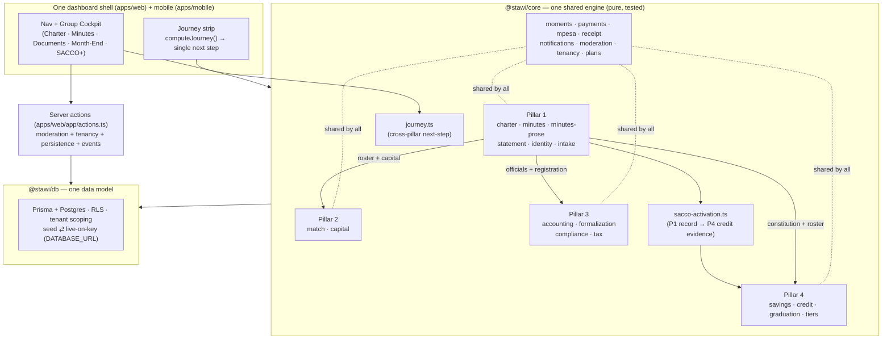

# Stawi — Architecture: Four Pillars, One App

Stawi is a chama-to-enterprise platform built as **four pillars that behave as a
single application**. This document explains the shared spines that harmonise
them, the one-way data flow between them, and the invariants that keep them
conflict-free as the app grows.

> Pillars: **1 — Records & Table Banking** · **2 — Business Matching** ·
> **3 — Accounting & Compliance** · **4 — Savings & Credit (SACCO+)**.

---

## 1. The one-app map

---

## 2. The seven shared spines

What makes four pillars one app is that they **share** everything that matters
and **own** only their own rules:

1. **One codebase, one engine.** A single Turborepo (`apps/web`, `apps/mobile`,
   `packages/core`, `packages/db`). Every pillar screen imports from the same
   `@stawi/core` with one export surface (`packages/core/src/index.ts`). No
   pillar keeps a private copy of a shared rule.
2. **One identity.** `identity.ts` makes the phone number the single credential.
   A member registered in the Pillar-1 charter is auto-linked to every group and
   every pillar their number appears in, with the role their designation implies.
3. **One-way data flow.** Pillar 1 is the single point of capture; later pillars
   *consume* its output (see §3). Data flows forward, never sideways into another
   pillar's internals.
4. **One data model + tenant isolation.** `packages/db` holds the schema and
   row-level security; `tenancy.ts` scopes every read/write. `dbEnabled()` runs
   the whole app on seed data offline and switches to Postgres when
   `DATABASE_URL` is set — uniformly, for all pillars.
5. **One write path.** Every mutation goes through the server actions in
   `apps/web/app/actions.ts`, which enforce the same contract everywhere:
   content moderation (`assertClean`), tenant isolation, persistence-or-safe-no-op,
   and realtime events.
6. **One money rail.** `mpesa.ts`, `payments.ts` and `receipt.ts` are shared
   plumbing — a Pillar-1 contribution, a subscription and a Pillar-4 deposit all
   move through the same rail and produce the same receipt shape.
7. **One self-directing spine.** `journey.ts` reads a group's state across all
   four pillars and returns the single most important next step, surfaced as the
   **journey strip** in the cockpit. Users never need to understand the pillar
   model — the app always answers "what do I do now?".

---

## 3. How data flows Pillar 1 → 2 / 3 / 4

Pillar 1 (the data-entry cockpit) is deliberately the foundation. Its captured
record feeds the others, with **zero re-entry**:

| From Pillar 1 | Feeds | Used for |
| --- | --- | --- |
| Charter roster + captured capital | **Pillar 2** | Business/venture matching |
| Officials + registration intent | **Pillar 3** | Accounting, compliance, formalization |
| Constitution + roster + month-end statements | **Pillar 4** | SACCO+ savings & credit |

The clearest example is **`sacco-activation.ts`**: it takes the exact Pillar-1
record (charter → officials → reconciled month-end statements) and produces a
`SaccoActivationPacket` — signatories auto-filled, member deposits distilled into
credit eligibility, and the lender-evidence checklist a bank asks for — so a
Pillar-1-only group joins Pillar 4 in one tap. That is the "smooth transition"
made literal in code.

---

## 4. The self-directing journey

`computeJourney(input)` maps a group's live state to a `GroupJourney`:

- **Per-pillar progress** — each pillar reports `status` (`locked` → `available`
  → `in_progress`/`ready` → `active`/`done`), a `pct`, and a plain-language
  `summary`.
- **A single focus** — the one next step across the whole app, chosen on a
  self-directing ladder: finish the **records** foundation → gain **legal
  standing** (register) → **activate SACCO+** when lender-ready → keep **books**
  → grow via **matching**.

The journey strip renders this above the cockpit tabs. Each pillar chip links to
its next action (an in-cockpit tab or a cross-route page), and the "👉 Next"
button always points at the current focus. Inputs are primitives handed in by
each pillar — `journey.ts` imports nothing from other modules, so it cannot
introduce coupling.

---

## 5. Invariants that keep the pillars conflict-free (longevity)

These are the rules that let the four pillars evolve independently without
stepping on each other:

- **Single source of truth per rule.** A business rule lives in exactly one
  `@stawi/core` module; pillars call it, never re-implement it.
- **Pure core, effects at the edges.** `@stawi/core` is pure and integer-cents;
  all I/O (DB, auth, network, M-Pesa) lives in `apps/*` and `packages/db`. This
  is why the whole engine is unit-testable and deterministic.
- **One-way dependencies.** Data flows 1 → 2/3/4 and via explicit bridges
  (`sacco-activation`, `journey`). No module reaches back into a consumer.
- **Additive change only.** New capability is a new module + new export + new
  tests. Existing exports keep their shape; migrations are forward-only.
- **Tenancy everywhere.** Every write is tenant-scoped; RLS is the backstop.
- **Tests are the contract.** `packages/core` ships with a full vitest suite
  (200+ tests). Each new module lands with its own tests; CI must be green before
  deploy (`PRE-DEPLOY-CHECKLIST.md`).
- **Seed ⇄ live parity.** Every pillar behaves identically with or without
  `DATABASE_URL`; nothing is "more live" than anything else.

---

## 6. Where things live

| Concern | Location |
| --- | --- |
| Shared business logic (all pillars) | `packages/core/src/*` (one export in `index.ts`) |
| Cross-pillar bridges | `sacco-activation.ts`, `journey.ts` |
| Data model, RLS, repo helpers | `packages/db` |
| Web app + dashboard + cockpit | `apps/web/app` |
| Mobile (Expo) parity | `apps/mobile` |
| Write path (all mutations) | `apps/web/app/actions.ts` |
| Money rail | `mpesa.ts`, `payments.ts`, `receipt.ts` |
| Retention across pillars | `moments.ts` |
| Pillar-1 deep dive | `docs/PILLAR-1-COCKPIT.md` |
| Product scope & pillars | `PRD.md` |

*Last updated 2026-07-18.*
